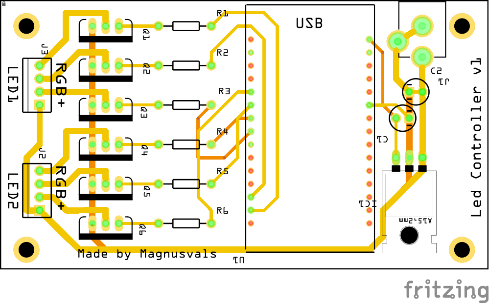

# ESP8266-6-Channel-Led-Controller

In this little project I will be making a RGB led strip controller for multiple led strips, 2 in this project
I will also make and order custom PCBs from [JLCPCB](https://jlcpcb.com/) (not sponsored :) ) since thay are cheep, reliable and fast.

# Components I used:
* 1 x [NodeMCU ESP8266 Development board](https://www.ebay.com/sch/i.html?_from=R40&_trksid=m570.l1313&_nkw=nodemcu+esp8266+esp-12+v3&_sacat=65507&LH_TitleDesc=0&_osacat=65507&_odkw=nodemcu+esp8266+esp-12)
* 3 x [IRF510](https://www.ebay.com/sch/i.html?_from=R40&_trksid=m570.l1313&_nkw=irf510&_sacat=0&LH_TitleDesc=0&_osacat=0&_odkw=irf510n)
* [RGB led strip](https://www.ebay.com/sch/i.html?_from=R40&_trksid=m570.l1313&_nkw=5050+SMD+600+LED+RGB+&_sacat=0&LH_TitleDesc=0&_osacat=0&_odkw=2+x+5M+10M+5050+SMD+600+LED+RGB+Flexible+Strip+Light+Car+Auto+DC+12V+ED)
* 1 x [LM7805 Voltage regulator](https://www.ebay.com/sch/i.html?_from=R40&_trksid=m570.l1313&_nkw=lm7805cv&_sacat=0&LH_TitleDesc=0&_osacat=0&_odkw=lm7805)
* 2 x [1μF Capasitor](https://www.ebay.com/sch/i.html?_nkw=1uf+capacitor+electrolytic&_sop=15)
* 3 x [1kΩ Resistor](https://www.ebay.com/sch/i.html?_from=R40&_trksid=m570.l1313&_nkw=1k+resistor&_sacat=0)
* 2 x [4 screw terminal](https://www.ebay.com/sch/i.html?_from=R40&_nkw=4p+2.54mm+screw+terminal&_sacat=0&rt=nc&LH_BIN=1)
* 1 x [DC barrel Jack (5.5x2.5)](https://www.ebay.com/sch/i.html?_from=R40&_trksid=m570.l1313&_nkw=DC+Power+Jack+supply+socket+2.5mm+Female+PCB&_sacat=0)
* 1 x Custom PCB (You can use [Protoboard](https://www.ebay.com/sch/i.html?_from=R40&_trksid=m570.l1313&_nkw=protoboard+dot&_sacat=0&LH_TitleDesc=0&_osacat=0&_odkw=protoboard) as well)

Images, sketches and PCB made using [Fritzing](https://fritzing.org/home/).

